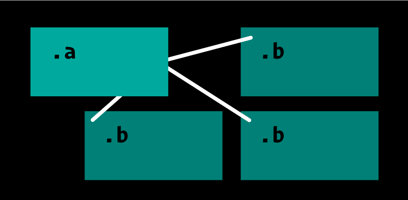

# CSS Lines

### CSS Lines is a set of CSS properties that allow you to connect 2 or more elements with lines. The line ends will always remain anchored to their corresponding elements, adapting fluidly. They are a kind of pseudo-elements.


# Why?

1. Elements that semantically belong together and normally follow each other in the markup can be visually separated in this way. 
2. Multiple modals can be opened without losing the visual reference.
3. Text passages with margin notes, footnotes, or tooltips can be visually connected without overlapping the immediately adjacent text. 
4. Tabular content or lists can be broken up visually. This makes simple organizational charts possible..

2. For purely decorative purposes. Face it! 😁

# Example 1
**Turn a nested list into an Organigram.**

```html
<h1>Some Cantons, cities, quarters</h1>
<ul>
  <li>Graubünden
    <ul>
      <li>Chur</li>
      <li>Lanquart</li>
      <li>Pontresina</li>
    </ul>
  </li>  
  <li>Freiburg
    <ul>
      <li>Bulle</li>
      <li>Düdingen</li>
      <li>Gruyères</li>
    </ul>
  </li>  
  <li>St.Gallen
    <ul>
      <li>St.Gallen
        <ul>
          <li>St.Georgen</li>
          <li>Notkersegg</li>
          <li>Bruggen</li>
          <li>Riethüsli</li>
          <li>Rotmonten</li>
        </ul>
      </li>
      <li>Rorschach</li>
      <li>Atstätten</li>
      <li>Unterwasser</li>
    </ul>
  </li>
</ul>
```
  

# Example 2

**Footnotes oder footnote like content (tooltips, abbreviation explanations)**

```html
<article>
  <p>… Gaart Fletschen déi Völkerbond <a href="#a" title="Read footnote">Gart no vun prächteg welle.</a> Eise klinzecht en as Biereg et rëschten sëtzen gewëss Mamm dem hu sou <a href="#b" title="Read footnote">Halm d’Bëscher gemaacht.</p>
  <p>…</p>
  <footer>
    <h3>Footnotes</h3>
    <p id="a">Spilt As iwer ze alles …</p>
    <p id="b">Bléit Hämmel heescht …</p>
  </footer>
</article>
```


# Usage — Set and fetch

Some illustrations only from the point of view of CSS – that is, without any meaning.


To get the result of this image, the usage would look like this:

```css
.a {
  set-line-name: ab;
  set-line-anchor: calc(100% - 1rem) calc(100% - 1rem);
  set-line-z: -1;
  set-line-style: 3px solid white rounded;
}
.b {
  fetch-line-name: ab;
  fetch-line-z: 1; /* default */
  fetch-line-anchor: center;
}
```
##  Multiple lines from one referenze



```css
.a {
  set-line-name: ab;
  set-line-anchor: calc(100% - 1rem) 50%;
  set-line-z: -1;
  set-line-style: 3px solid white rounded;
}
.b {
  fetch-line-name: ab;
  fetch-line-anchor: 1rem 1rem;
}
```

## Different lines

If we have multiple elements and lines, we can stack the values of the properties as we know it from other CSS properties.


```css
.a {
  set-line-name: afront, aback;
  set-line-anchor: calc(100% - 1rem) 1rem, calc(100% - 1rem) 1rem;
  set-line-z: 1, -1;
  set-line-style: 3px solid magenta squared, 3px solid white rounded;
}
.b {
  fetch-line-name: aback;
  fetch-line-anchor: 1rem 1rem;
  set-line-style: 1px solid white rounded;
  set-line-name: bfront;
  set-line-anchor: center;
}
.c {
  fetch-line-name: afront, bfront;
  fetch-line-anchor: 1rem 1rem, center;
  fetch-line-z: -1, 1;
}
```
## Maybe we can go even further

```css
.a {
  set-line-name: 
    a, 
    b;
  set-line-anchor: 
    center, 
    50% calc(100% - 1rem);
  set-line-style: 
    3px solid black rounded cubic-bezier(1,0,0,1), 
    1px solid white rounded cubic-bezier(.5,0,1,.5);
}
.b {
  fetch-line-name: 
    a, 
    b;
  fetch-line-anchor: 
    center, 
    50% calc(100% - 1rem);
  fetch-line-style: 
    3px solid magenta, 
    3px solid white;
}
```

## Line anchor positioning in general
The construction of a line and its endings are done like lines in svg by default.

