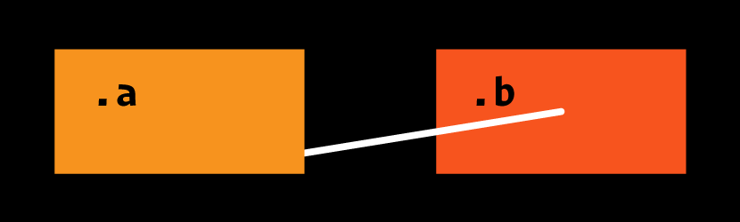
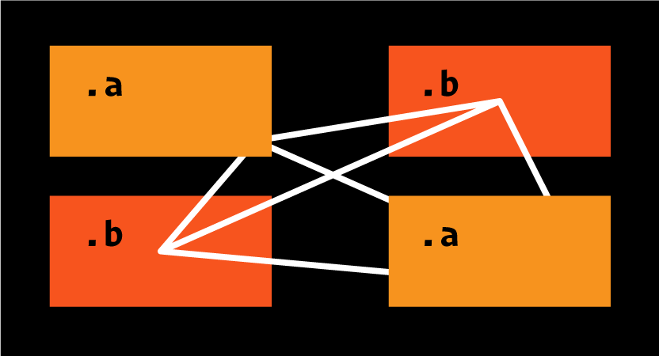
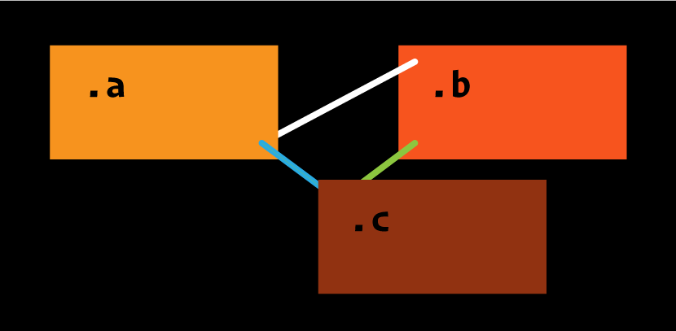
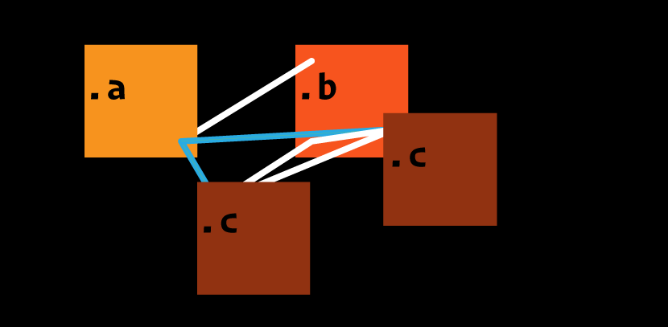
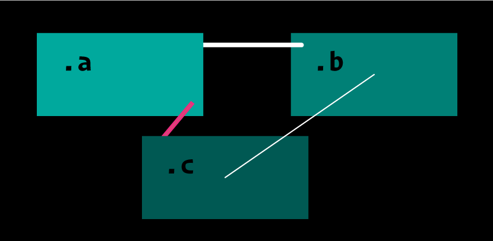
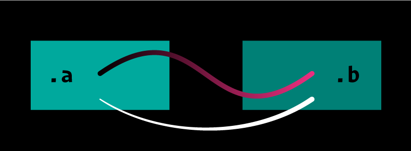
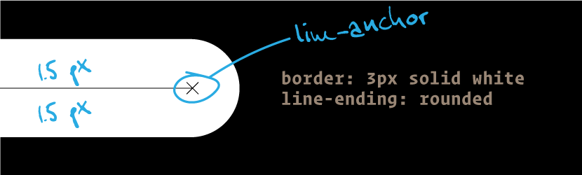

# CSS Lines

### CSS Lines is a set of CSS properties that allow you to connect 2 or more elements with a line. The line ends will always remain anchored to their corresponding elements, adapting fluidly. They are a kind of pseudo-elements.



# Why?

1. Elements that belong together semantically and follow each other structurally can be separated visually in this way. This is helpful if, for example, several modals have to be opened. Or when text passages are to be visually linked with margin notes or footnotes. Or when popups in texts should not overlay the immediately nearby text. Or for visually breaking up tabular content. Or for org charts and simple infographics that would otherwise require SVG.

2. For purely decorative purposes. Face it! 😁

---

> Below are samples of two approaches to how this might work. I am glad for co-thinkers. Have I forgotten anything? Is there something that can’t work and needs more properties or so?

 
# First idea — inspired by CSS animations

As in the heading image ↑.

```css
.a {
  line-name: snowball;
  line-anchor: calc(100% - 1rem) calc(100% - 1rem);
  line-z: -1;
  opacity: 0.8;
}
.b {
  line-name: snowball;
  line-anchor: center;
}
@line snowball {
  border: 3px solid white;
  line-ending: rounded;
}
```
If we extend this to several elements, it would automatically look like this.



##  More specific

If we want to set lines more specifically, we need to keep the lines apart by name.




```css

.a {
  line-name:   snowball, sky;
  line-anchor: calc(100% - 1rem) calc(100% - 1rem), calc(100% - 1rem) calc(100% - 1rem);
  line-z:      -1, 1;
}
.b {
  line-name:   snowball, lemon;
  line-anchor: 1rem 1rem, 1rem calc(100% - 1rem);
}
.c {
  line-name:   lemon, sky;
  line-anchor: 1rem 1rem, 1rem 1rem;
  line-z:      -1, -1;
}

@line snowball, lemon {
  border: 3px solid white;
  line-ending: rounded;
}
@line sky {
  border: 3px solid cyan;
  line-ending: rounded;
}
```

## Challenging z-index
If we add another element with an allready used class, it can beccome challenging with the `line-z`. 


> This is beyond my imagination and has to be tested in a simulation. The order of the HTML elements will probably also have to play a role.


# Second and probably better idea: Set and fetch lines



```css
.a {
  set-line-name: afront, aback;
  set-line-anchor: calc(100% - 1rem) 1rem, calc(100% - 1rem) 1rem;
  set-line-z: 1, -1;
  set-line-style: 3px solid magenta squared, 3px solid white rounded;
}
.b {
  fetch-line-name: aback;
  fetch-line-anchor: 1rem 1rem;
  set-line-style: 1px solid white rounded;
  set-line-name: bfront;
  set-line-anchor: center;
}
.c {
  fetch-line-name: afront, bfront;
  fetch-line-anchor: 1rem 1rem, center;
  fetch-line-z: -1, 1;
}
```

# Maybe we can go even further



```css
.a {
  set-line-name: 
    a, 
    b;
  set-line-anchor: 
    center, 
    50% calc(100% - 1rem);
  set-line-style: 
    3px solid black rounded cubic-bezier(1,0,0,1), 
    1px solid white rounded cubic-bezier(.5,0,1,.5);
}
.b {
  fetch-line-name: 
    a, 
    b;
  fetch-line-anchor: 
    center, 
    50% calc(100% - 1rem);
  fetch-line-style: 
    3px solid magenta, 
    3px solid white;
}
```

# Line anchor positioning in general

The construction of a line and its endings are done like lines in svg by default.

