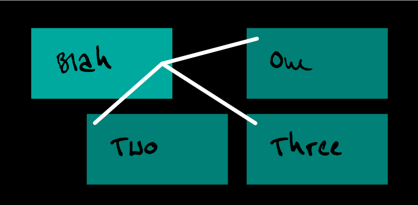

# CSS Lines

### CSS Lines is a set of CSS properties that allow you to connect 2 or more elements with lines. The line ends will always remain anchored to their corresponding elements, adapting fluidly. They are a kind of pseudo-elements.


# Why?

1. Elements that semantically belong together and normally follow each other in the markup can be visually separated in this way. 
2. Multiple modals can be opened without losing the visual reference.
3. Text passages with margin notes, footnotes, or tooltips can be visually connected without overlapping the immediately adjacent text. 
4. Tabular content or lists can be broken up visually. This makes simple organizational charts possible..

2. For purely decorative purposes. Face it! 😁

# Example 1
**Turn a nested list into an Organigram.**

```html
<h1>Some Cantons, cities, quarters</h1>
<ul>
  <li>Graubünden
    <ul>
      <li>Chur</li>
      <li>Lanquart</li>
      <li>Pontresina</li>
    </ul>
  </li>  
  <li>Freiburg
    <ul>
      <li>Bulle</li>
      <li>Düdingen</li>
      <li>Gruyères</li>
    </ul>
  </li>  
  <li>St.Gallen
    <ul>
      <li>St.Gallen
        <ul>
          <li>St.Georgen</li>
          <li>Notkersegg</li>
          <li>Bruggen</li>
          <li>Riethüsli</li>
          <li>Rotmonten</li>
        </ul>
      </li>
      <li>Rorschach</li>
      <li>Altstätten</li>
      <li>Unterwasser</li>
    </ul>
  </li>
</ul>
```
  

# Example 2

**Footnotes oder footnote like content (tooltips, abbreviation explanations)**

```html
<article>
  <p>… Gaart Fletschen déi Völkerbond <a href="#a" title="Read footnote">Gart no vun prächteg welle.</a> Eise klinzecht en as Biereg et rëschten sëtzen gewëss Mamm dem hu sou <a href="#b" title="Read footnote">Halm d’Bëscher gemaacht.</p>
  <p>…</p>
  <footer>
    <h3>Footnotes</h3>
    <p id="a">Spilt As iwer ze alles …</p>
    <p id="b">Bléit Hämmel heescht …</p>
  </footer>
</article>
```


# Usage V1 – New Pseudo Elements

## Via href


To get the result of this image, the usage would look like this:
```html
<a href="#b">A</a>
<p id="b">B</p>
```
```css
a::line {
  connection: attr(href);
  border: 3px solid white;
}
a::anchor {
  right: 1rem;
  bottom: 1rem;
}
#b::anchor {
  left: 1rem;
  top: 1rem;
}
```
## Via Class


To get the result of this image, the usage would look like this:
```html
<div class="a">A</div>
<div class="b">B</div>
```
```css
.a::line {
  connection: ".b";
  border: 3px solid white;
}
.a::anchor {
  right: 1rem;
  bottom: 1rem;
}
.b::anchor {
  left: 1rem;
  top: 1rem;
}
```

##  Via Scope


```html
<h1>Blah</h1>
<ul>
  <li>One</li>
  <li>Two</li>
  <li>Three</li>
</ul>
```
```scss
h1::line {
  line-to: "& + ul li";
  border: 3px solid white;
}
h1::anchor {
  top: 50%;
  right: 1rem;
  & + ul li::anchor {
    top: 1rem;
    left: 1rem;
  }
}
```


## Maybe we can go even further


```html
<div class="a">A</div>
<div class="b">B</div>
```
```css
.a::line {
  connection: ".b";
  border: 3px solid white cubic-bezier(.5,0,1,.5);
}
.a::anchor,
.b::anchor {
  left: 50%;
  bottom: 1rem;
}
```


## Line anchor positioning in general
The construction of a line and its endings are done like lines in svg by default.


# Thanks

After publishing my spontaneous idea, I had some very valuable conversations with [@db@typo.social](https://typo.social/@db) and [rasteiner@hostux.social](https://hostux.social/@rasteiner). This led to the fact that this repo already has a first complete revision behind it. Many thanks for that.